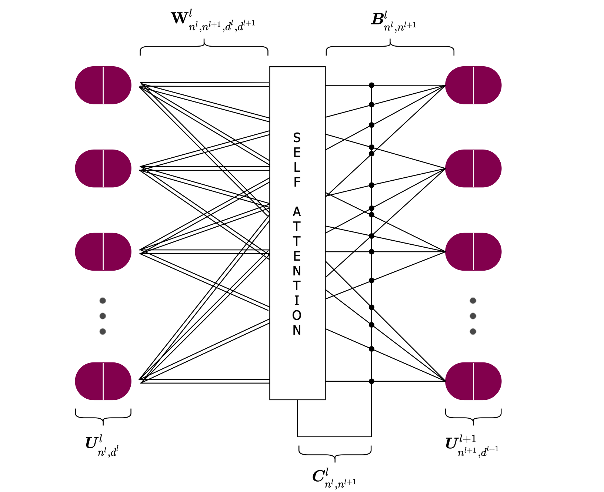
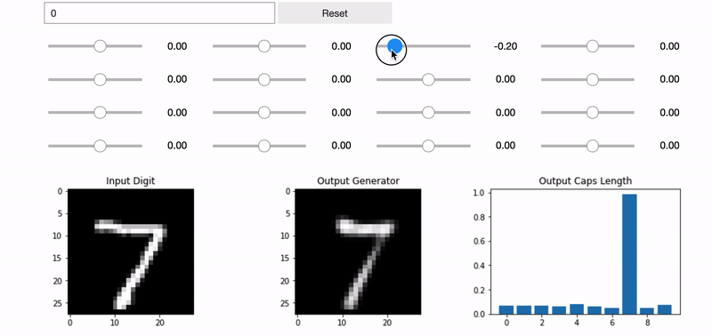

<h1 align="center"> ~ Efficient-CapsNet ~ </h1>
Are you tired of over inflated and overused convolutional neural networks? You're right! It's time for <strong>CAPSULES</strong> :)
<br>
This repository has been made for two primarly reasons:

 - open source the code (most of) developed during our "first-stage" research on capsules, summarized by the forthcoming "Efficient-CapsNet: Capsule Network with Self-Attention Routing" article. The repository let you play with Efficient-CapsNet and let you set the base for your own experiments.
 - be an hub and a headlight in the cyberspace to spread to the machine learning comunity the intrinsic potential and values of capsule. However, albeit remarkable results achieved by capsule networks, we're fully aware that they're only limited to toy datasets. Nevertheless, there's a lot to make us think that with the right effort and collaboration of the scientific community, capsule based networks could really make a difference in the long run. For now, feel free to dive in our work :))
 
 <p align="center">
  
</p>

# 1.0 Getting Started

## 1.1 Installation

Python3 and Tensorflow 2.x are required and should be installed on the host machine following the official guide. Good luck with it!

1. Clone this repository
   ```bash
   git clone https://github.com/EscVM/Efficient-CapsNet.git
   ```
2. Install the required packages
   ```bash
   pip3 install -r requirements.txt
   ```
Peek inside the requirements file if you have everything already installed. Most of the dependencies are common libraries.

# 2.0 Efficient-CapsNet Notebooks
The repository provides two starting notebooks to make you confortable with our architecture. They have all the information and explanations to let you dive further  in new research and experiments. 
The [first](https://github.com/EscVM/Efficient-CapsNet/blob/main/efficient_capsnet_test.ipynb) one let you test Efficient-CapsNet over three different datasets. The repository is provided with some of the weights derived by our own experiments.
On the other hand, the [second](https://github.com/EscVM/Efficient-CapsNet/blob/main/efficient_capsnet_train.ipynb) one let you train the network from scratch. It's a very lightweight network so you don't need "Deep Mind" TPUs arsenal to train it. However, a GP-GPU is not compulsory, but strongly suggested (No GPU, no deep learning, no party).

# 3.0 Original CapsNet Notebooks
It goes without saying that our work has been inspiered by Geoffrey Hinton and his article "[Dynamic Routing Between Capsules](https://arxiv.org/abs/1710.09829)". It's really an honor to build on his idea. Nevertheless, when we did our first steps in this capsule world, we were pretty disappointed in finding all repository/implementation ultimately wrong in some aspects. So, we implemented everything from scratch, carefully following the original Sara's [repository](https://github.com/Sarasra/models/tree/master/research/capsules). However, our implementation, besides beeing written for the new TensorFlow 2 version, is much more easier and practical to use. Sara's one is really overcomplicated and too mazy that you can lost pretty easily.

As for the previous section we provide two notebooks, [one](https://github.com/EscVM/Efficient-CapsNet/blob/main/original_capsnet_test.ipynb) for testing (weights have been derived from Sara's repository) and [one](https://github.com/EscVM/Efficient-CapsNet/blob/main/original_capsnet_train.ipynb) for training. 

Nevertheless, there's a really negative note (at least for us:)); as all other repositories that you can find on the web, also our one is not capable to achieve the scores reported in their [paper](https://arxiv.org/abs/1710.09829). We really did our best, but there was no way to make the network achieve a score greater of 99.64% on MNIST. Exactly for this reason, weights provided in this repository are derived from their repository. Anyway is Geoffrey so we can excuse him.


# 4.0 Capsules Dimensions Perturbation Notebook
To be done!
 <p align="center">
  
</p>
